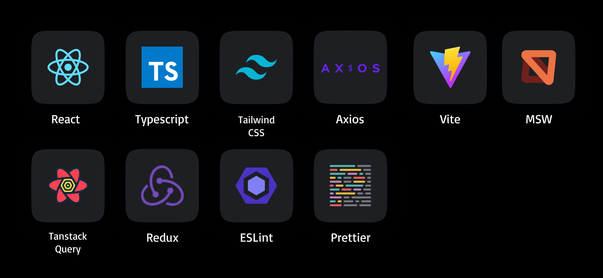

  
   
  <h2>캠핑장 예약 및 관리 서비스, CampU</h2>

 
 

    

  
 

## 목차

1. [**웹 서비스 소개**](#1)
1. [**기술 스택**](#2)
1. [**주요 기능**](#3)
1. [**시스템 아키텍쳐**](#4)
1. [**서비스 화면**](#5)
1. [**개발 팀 소개**](#6)
1. [**개발 기간 및 일정**](#7)
1. [**산출물**](#8)

 <!-- 1. [**실행 방법**](#8) -->

 

## ✨ 웹 서비스 소개

최근 몇 년간 야외 활동과 자연 속에서의 레저 활동이 인기를 끌고 있습니다.

이러한 트렌드에 따라 캠핑장 예약 수요가 증가하고 있습니다.

그래서 소비자들이 간편하게 캠핑장 정보를 찾고 예약을 할 수 있는 서비스를 준비했습니다!

또한 사장님들은 캠핑장 등록 및 관리 시스템을 통해 운영을 효율적으로 할 수 있습니다.

### [CampU 바로 가기](https://k10d106.p.ssafy.io)

 

## 🛠️ 기술 스택

### Frontend

 

### Backend

 

### Infra

 

### Tools

 
 

## 💡 주요 기능

### 소비자

|        기능         | 내용                                                                                           |
| :-----------------: | :--------------------------------------------------------------------------------------------- |
|     캠핑장 검색     | 지역, 날짜, 인원수, 키워드를 기반으로 조건에 맞는 캠핑장을 찾아볼 수 있습니다.                 |
| 캠핑장 예약 및 취소 | 원하는 캠핑장을 카카오페이로 결제할 수 있습니다. 사유 입력과 함께 예약을 취소할 수도 있습니다. |
|  빈자리 알림 등록   | 캠핑장 방이 예약 마감되었다면 빈자리 알림을 등록할 수 있습니다.                                |
|      알림 수신      | 빈자리가 났을 때, 캠핑장 예약 및 취소 시 알림을 받습니다.                                      |
|      리뷰 등록      | 캠핑을 다녀온 후 별점과 후기를 포함한 리뷰를 작성할 수 있습니다.                               |

### 사장님

|       기능        | 내용                                        |
| :---------------: | :------------------------------------------ |
| 캠핑장 및 방 등록 | 사장님은 캠핑장과 방을 등록할 수 있습니다.  |
|  예약 내역 조회   | 소비자들의 예약 현황을 조회할 수 있습니다.  |
|     알림 수신     | 소비자들이 예약 및 취소 시 알림을 받습니다. |

 

## 📂 시스템 아키텍쳐

 

## 🖥️ 서비스 화면

### 로그인

- 회원가입 후 로그인 가능

 

### 캠핑장 검색

- 지역, 날짜, 인원수, 키워드 기반으로 캠핑장 검색 가능
- 관심 있는 캠핑장 즐겨찾기에 등록 가능
- 캠핑장을 클릭하여 캠핑장 상세 페이지로 이동 가능

 

### 캠핑장 예약

- 카카오페이 결제를 통해 캠핑장 예약 가능
- 예약 완료 시 알림 수신

 

### 캠핑장 취소

- 사유 입력과 함께 캠핑장 예약 취소 가능
- 예약 취소 시 알림 수신

 

### 빈자리 알림 등록

- 예약이 마감된 캠핑장 방에 대해 빈자리 알림 등록 가능
- 빈자리 났을 시 알림 수신

 

### 마이페이지

- 예약 내역, 내가 쓴 리뷰, 즐겨찾기한 캠핑장 등 조회 가능

 

### 캠핑장 등록 및 관리

- 캠핑장 및 방 등록 가능
- 캠핑장 및 방 정보 수정 가능
- 예약 현황 조회 가능

 

## 👨🏻‍💻 개발 팀 소개

|                   |      |         |   |       |              |
| :----------------------------------------------------------------------: | :---------------------------------------------------------: | :---------------------------------------------------------------: | :---------------------------------------------------: | :-----------------------------------------------------------: | :-----------------------------------------------------------------: |
| [서준호 @hoing97s](https://github.com/hoing97s) `BE` `Leader` | [박단비 @danbeeS2](https://github.com/danbeeS2) `FE` | [신주용 @cheesecat47](https://github.com/cheesecat47) `BE` | [이귀현 @Agwii](https://github.com/Agwii) `FE` | [최민경 @minnnnnk0](https://github.com/minnnnnk0) `FE` | [최호조 @choihojo](https://github.com/choihojo) `BE` `Infra` |

 

## 🗓️ 개발 기간 및 일정

2024.04.08. ~ 2024.05.20.

<!--  

## 실행 방법 -->

 

## 📝 산출물

### 1. [기능 명세서](https://www.notion.so/7448794bd17843dbadbf0e1937ad9529?pvs=4)

### 2. [와이어 프레임](https://www.figma.com/file/VCiAwMr9ALDSOQVFhLeQkp/D106?type=design&node-id=3-4&mode=design&t=rFtdG1SdhvPmAehQ-0)

### 3. [API 명세서](https://www.notion.so/API-API-937382b92ab049bd8ed8b7a0a82ec581?pvs=4)

### 4. [ERD](https://dbdiagram.io/d/d106-662481d203593b6b6186baab)

### 5. [포팅매뉴얼]()

- [Frontend 포팅매뉴얼](https://github.com/d106-campu/campu/blob/main/exec/01.%20%ED%8F%AC%ED%8C%85%20%EB%A7%A4%EB%89%B4%EC%96%BC/BACKEND-MANUAL.md)
- [Backend 포팅매뉴얼](https://github.com/d106-campu/campu/blob/main/exec/01.%20%ED%8F%AC%ED%8C%85%20%EB%A7%A4%EB%89%B4%EC%96%BC/FRONTEND-MANUAL.md)
