# CampU 시연 시나리오

> 시연 순서에 따른 site 화면별, 실행별(클릭 위치 등) 상세 설명

---

<!-- TOC -->

* [CampU 시연 시나리오](#campu-시연-시나리오)
    * [시나리오 1: 캠핑장 검색, 예약](#시나리오-1-캠핑장-검색-예약)

<!-- TOC -->

---

## 시나리오 1: 캠핑장 검색, 예약

| &nbsp;&nbsp;&nbsp;&nbsp;&nbsp;&nbsp;&nbsp;&nbsp;&nbsp;&nbsp; 설명 &nbsp;&nbsp;&nbsp;&nbsp;&nbsp;&nbsp;&nbsp;&nbsp;&nbsp;&nbsp; |                                                          화면                                                          |
|:-----------------------------------------------------------------------------------------------------------------------------|:--------------------------------------------------------------------------------------------------------------------:|
| 캠핑장 검색. 지역, 날짜, 인원수를 입력하고 '검색하기' 버튼 클릭.                                                                                   |                                         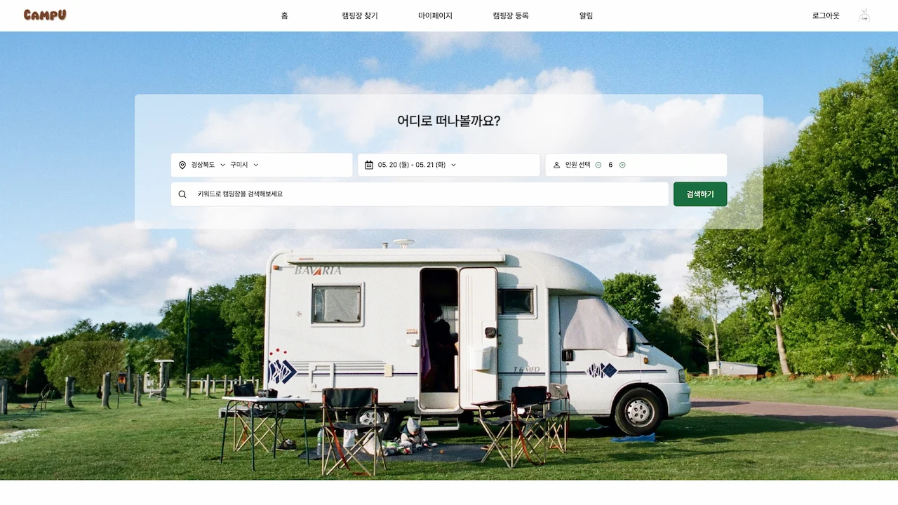                                         |
| 지도상에 마커로 캠핑장 위치 표시. 마커를 누르면 해당 캠핑장이 초록색 배경으로 강조됨. '호 카라반 캠핑'의 '상세보기' 버튼 클릭.                                            |                                         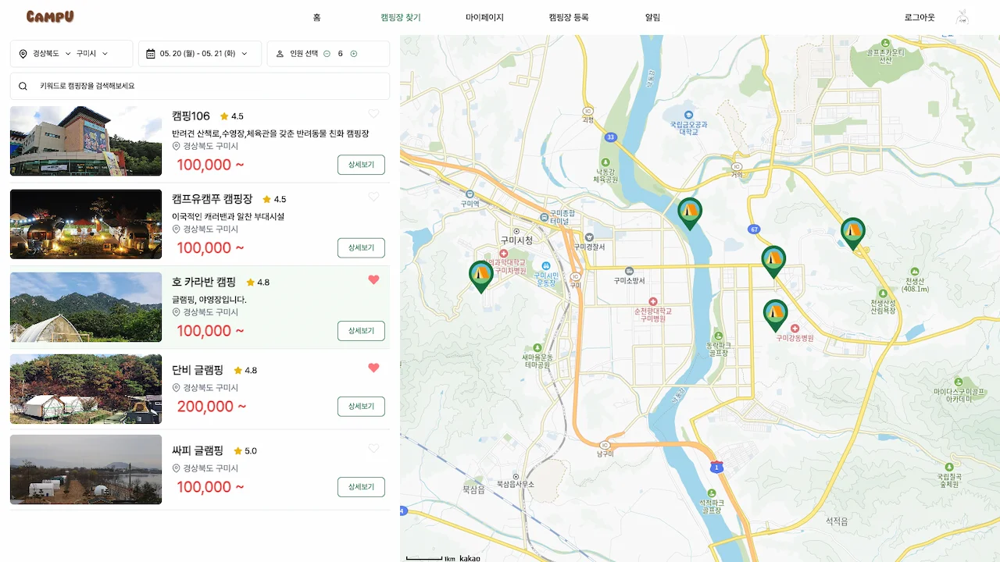                                         |
| 캠핑장 상세 페이지. 캠핑장 사진, 소개, 배치도, 리뷰 등을 볼 수 있음. 해당 캠핑장의 방 중 인원수를 수용 가능한 방 목록이 보여지는데, 원하는 기간에 이미 예약이 있다면 '예약 마감'으로 표시됨.      |                                         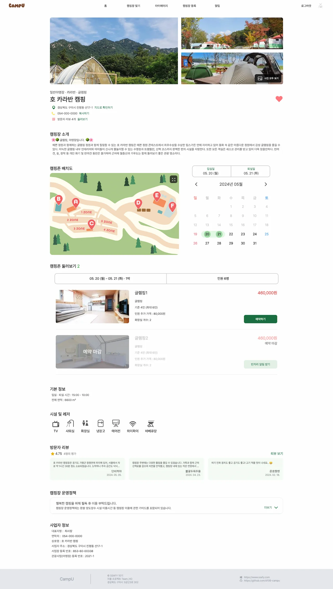                                         |
| 캠핑장에 달린 리뷰도 볼 수 있음.                                                                                                          |                                         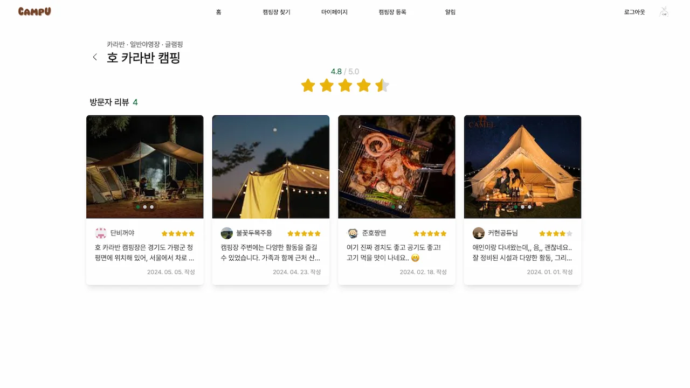                                         |
| '예약하기' 버튼을 누르면 예약 전 정보 확인 페이지로 이동함. 간편 결제를 통해 손쉽게 캠핑장 결제 가능.                                                              | 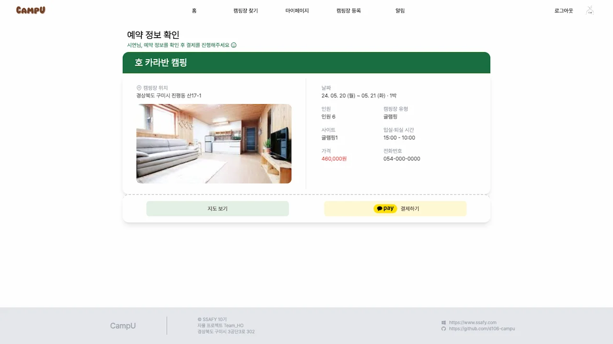 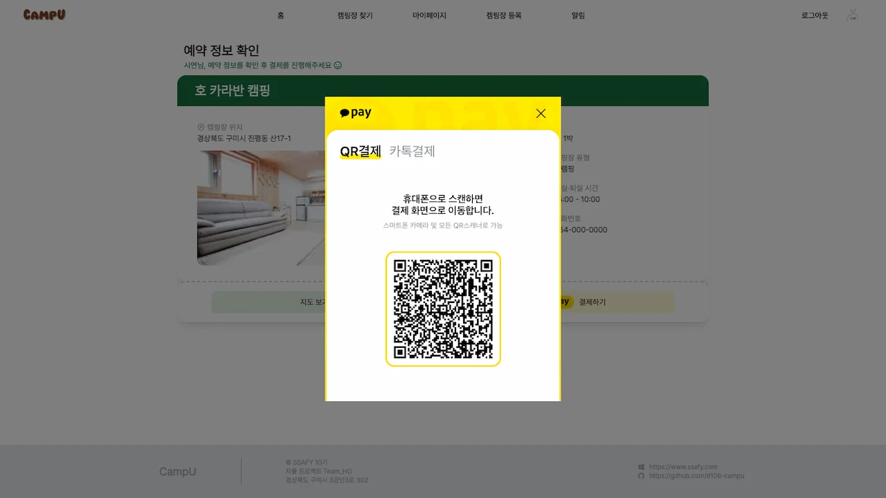 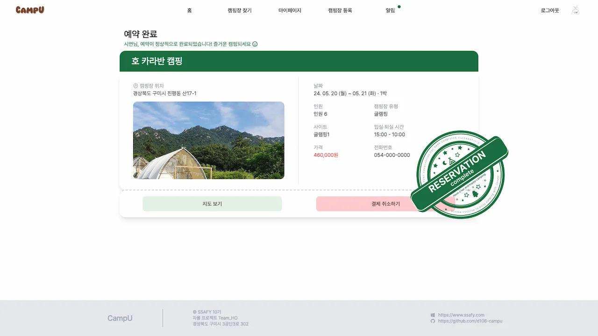 |

## 시나리오 2: 마이페이지

| &nbsp;&nbsp;&nbsp;&nbsp;&nbsp;&nbsp;&nbsp;&nbsp;&nbsp;&nbsp; 설명 &nbsp;&nbsp;&nbsp;&nbsp;&nbsp;&nbsp;&nbsp;&nbsp;&nbsp;&nbsp; |                                                          화면                                                          |
|:-----------------------------------------------------------------------------------------------------------------------------|:--------------------------------------------------------------------------------------------------------------------:|
| '마이페이지 > 예약 내역'에서 확인 가능.                                                                                                     |                                         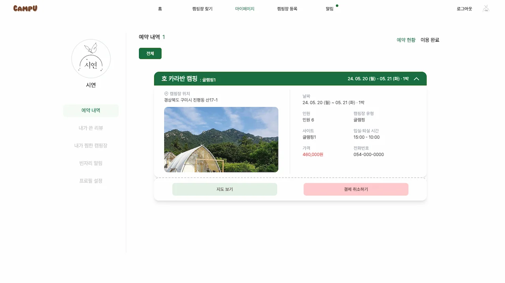                                         |
| '내가 쓴 리뷰'에서 리뷰 목록 확인 가능. 내가 실제로 방문했던 캠핑장에만 리뷰 작성 가능.                                                                         |                                         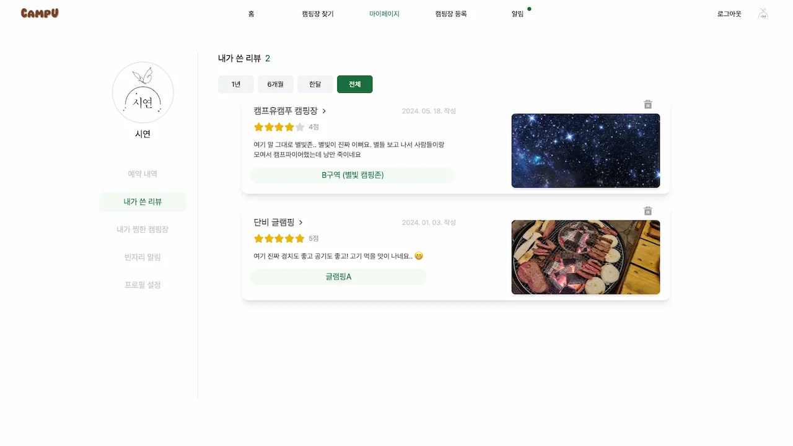                                         |
| '내가 찜한 캠핑장'에서 찜한(좋아요 하트를 누른) 캠핑장 목록 조회 가능.                                                                                   |                                         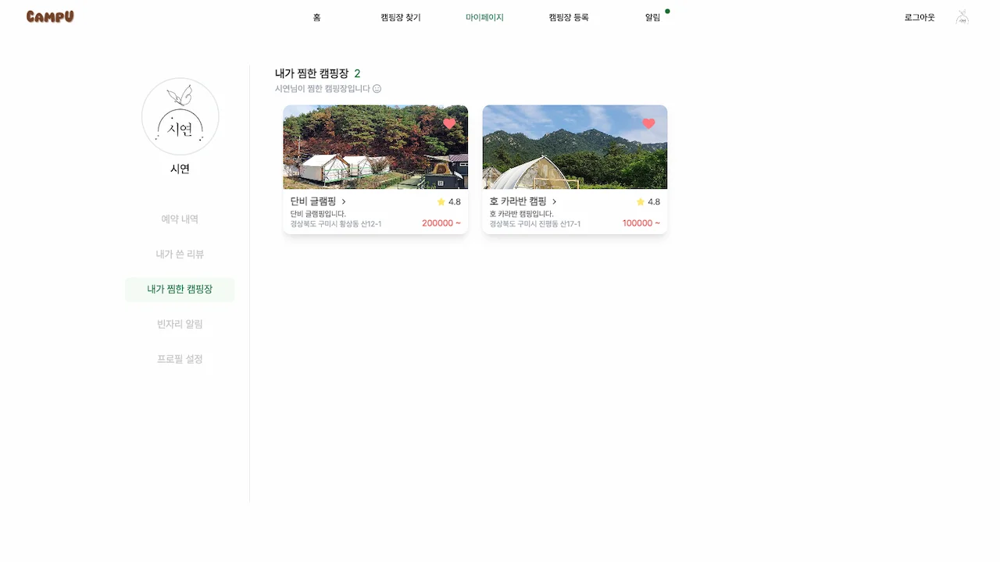                                         |
| 예약 마감된 방이 취소되어 자리가 생길 경우 알림을 받는 '빈자리 알림' 기능이 있음. '캠핑장 상세보기 페이지' 방 예약 시 알림 등록 가능. '마이페이지 > 빈자리 알림'에서 확인 가능.             | 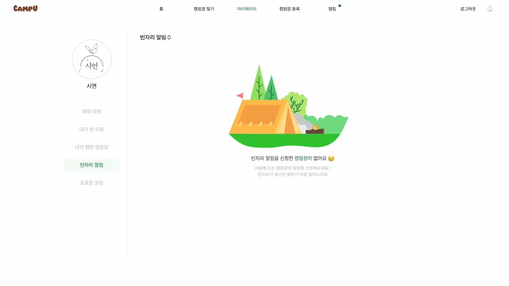 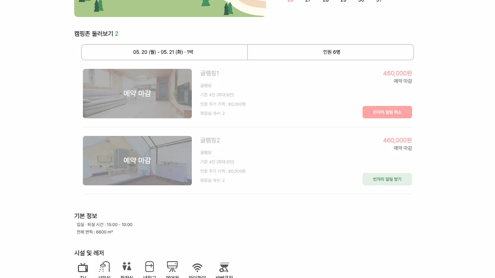 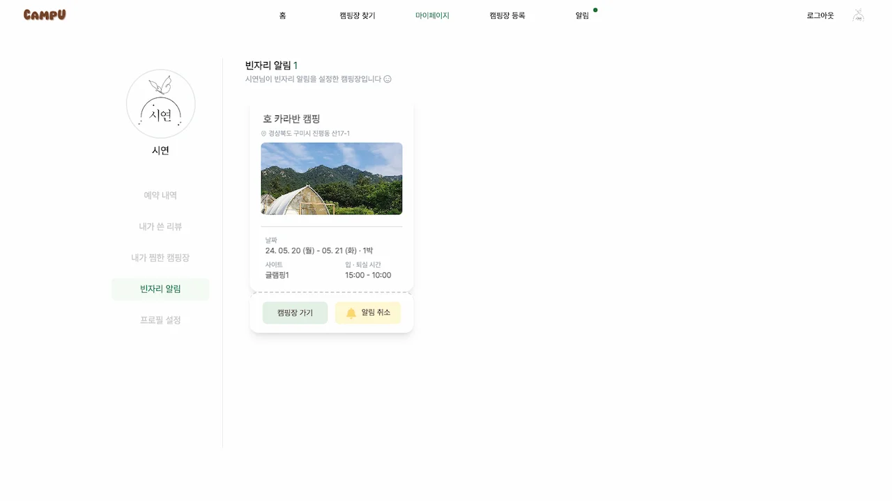 |

## 시나리오 3: 사장님 캠핑장 예약 관리

| &nbsp;&nbsp;&nbsp;&nbsp;&nbsp;&nbsp;&nbsp;&nbsp;&nbsp;&nbsp; 설명 &nbsp;&nbsp;&nbsp;&nbsp;&nbsp;&nbsp;&nbsp;&nbsp;&nbsp;&nbsp; |                  화면                  |
|:-----------------------------------------------------------------------------------------------------------------------------|:------------------------------------:|
| 캠핑장은 사장님 사업자 등록 번호를 통해 등록됨. 캠핑장 정보 수정 가능. 방 정보 수정 가능.                                                                  | 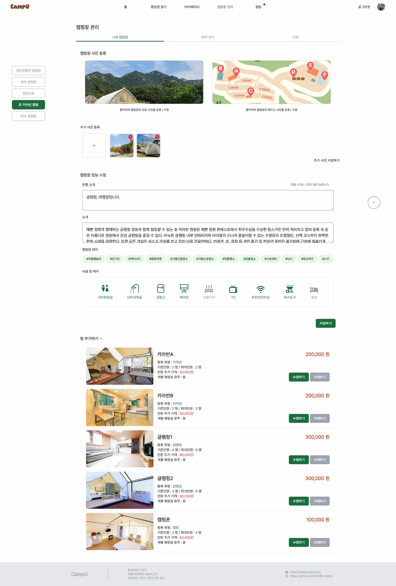 |
| 사장님은 특정 날짜에 예약된 내역을 볼 수 있음.                                                                                                  | 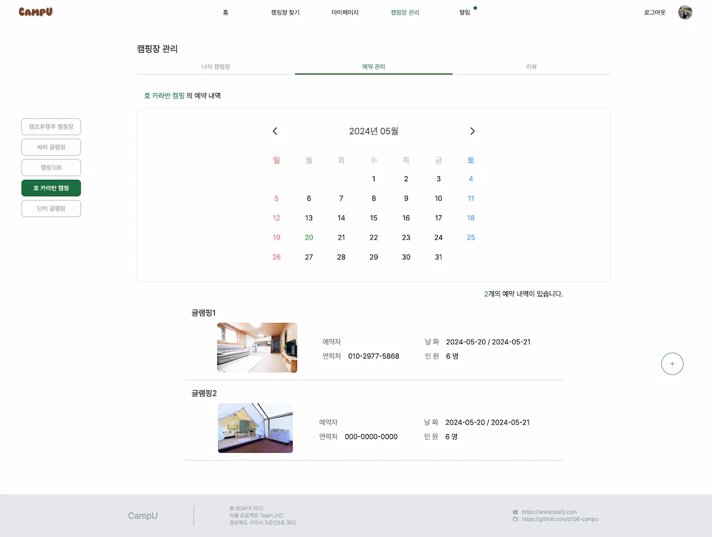 |
| 사장님은 관리하는 캠핑장에 남겨진 리뷰를 볼 수 있음.                                                                                               |  |
